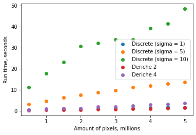

# Image convolutions algorithms

Репозиторий содержит многопоточную имплементацию дискретного и рекурсивного алгоритмов свертки изображения на C++20 и OpenCV и демонстрацию их практического применения для размытия изображения. Для успешной компиляции и запуска проекта необходимо предустановить OpenCV.

## Отчет
### Краткое сведение по асимптотической сложности алгоритмов:
+ Дискретный алгоритм работает за `O(nmk/t)`, где `n` и `m` – размеры изображения, `k` - размер фильтра, прямопропорциональный введенной сигме, `t` – кол-во потоков
+ Рекурсивный алгоритм работает за `O(nmk/t)`, где  `n` и `m` – размеры изображения, `k` - глубина рекурсии, равная двум для свертки `deriche2` и четырем для свертки `deriche4`, `t` – кол-во потоков

### Эффективность работы и бенчмарки
Ниже приведена таблица зависимости времени работы от размера входных данных (кол-во пикселей), сигмы и версии алгоритма:

| Total pixels | Discrete (σ = 1)    | Discrete (σ = 5)   | Discrete (σ = 10)   | Deriche 2 | Deriche 4 |
|--------------|---------------------|--------------------|---------------------|-----------|-----------|
| 0.5m         | 0.394               | 3.151              | 11.012              | 0.158     | 0.359     |
| 1.0m         | 0.540               | 4.629              | 17.788              | 0.266     | 0.806     |
| 1.5m         | 0.695               | 6.205              | 23.177              | 0.376     | 1.132     |
| 2.0m         | 0.799               | 7.389              | 30.642              | 0.476     | 1.208     |
| 2.5m         | 0.953               | 8.583              | 32.005              | 0.615     | 1.742     |
| 3.0m         | 1.187               | 9.762              | 33.929              | 0.701     | 1.965     |
| 3.5m         | 1.212               | 11.081             | 33.929              | 0.780     | 2.242     |
| 4.0m         | 1.384               | 11.781             | 39.307              | 0.989     | 2.830     |
| 4.5m         | 1.503               | 12.851             | 41.482              | 1.057     | 3.095     |
| 5.0m         | 1.638               | 13.519             | 48.424              | 1.287     | 3.441     |

Ниже приведен график, построенный по данным из таблицы: 

### Вывод
Рекурсивный алгоритм работает одинакового эффективно вне зависимости от сигма, делая его наиболее выгодным и пригодным, по сравнению с дискретным агоритмом.

## Источники
+ [Описание дискретной гауссовой свертки](https://en.wikipedia.org/wiki/Canny_edge_detector)
+ [Описание алгоритма гауссовой свертки по Деришу второго уровня глубины](https://en.wikipedia.org/wiki/Deriche_edge_detector)
+ [Оригинальная статья Дериша про гауссову свертку четвертого уровня глубины](https://hal.inria.fr/inria-00074778/document)
+ [Улучшение оригинальной статьи Дериша](https://www.yumpu.com/en/document/read/36483672/improving-deriche-style-recursive-gaussian-filters). Читается проще и **содержит верный коэфициент нормировки** `scale`, в отличии от предыдущей статьи!

## Copyright

Все материалы доступны по лицензии [Creative Commons «Attribution-ShareAlike» 4.0](http://creativecommons.org/licenses/by-sa/4.0/). \
При заимствовании любых материалов из данного репозитория, необходимо оставить ссылку на него, а также, указать мое имя: **Константин Леладзе**.

__© Konstantin Leladze__
